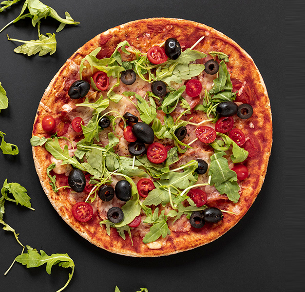
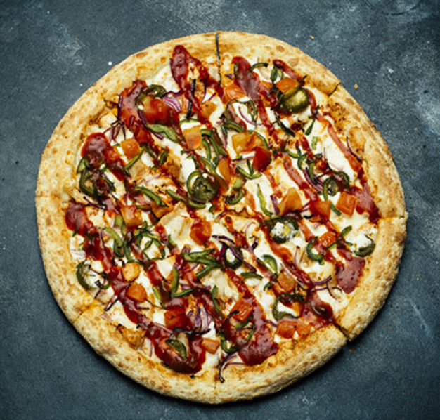

# 🍕 Order Pizza Online

Welcome to **Order Pizza Online**, a modern, user-friendly interface to browse and order delicious wood-fired pizzas, pasta, and more! 😋 This project showcases a responsive web page built with **HTML**, **CSS**, and **Bootstrap**.

---

## 🌟 Features

- **Elegant UI** with a clean and modern design.
- **Search Bar** to quickly find your desired items.
- Responsive layout for seamless experience on any device.
- Visual showcase of the menu with attractive imagery.

---

## 📂 Project Structure

```
├── index.html        # Main HTML file
├── style.css         # Custom CSS for styling
├── images/           # Contains all pizza images and logo
└── README.md         # Documentation for the project
```

---

## 📸 Screenshots

### 🍍 Hawaiian Pizza View


### 🍗 Chicken Pizza View


### 🧀 Salami Pizza View


---

## 🔧 Tech Stack

- **HTML5**: For the structure of the webpage.
- **CSS3**: For custom styling and layout.
- **Bootstrap 5**: For responsive design and prebuilt components.

---

## 🚀 Getting Started

1. Clone the repository:
   ```bash
   git clone https://github.com/your-username/order-pizza-online.git
   ```
2. Navigate to the project folder:
   ```bash
   cd order-pizza-online
   ```
3. Open `index.html` in your preferred browser:
   ```bash
   open index.html
   ```

---

## 🤝 Contributing

Contributions are welcome! Feel free to:
- Fork the repository
- Create a feature branch
- Submit a pull request

---

## 📄 License

This project is licensed under the MIT License. See the [LICENSE](LICENSE) file for details.

---

## ✨ Acknowledgments

- Bootstrap CDN for responsive design components.
- High-quality pizza images sourced for aesthetic appeal.

---

Happy Coding! 🚀
